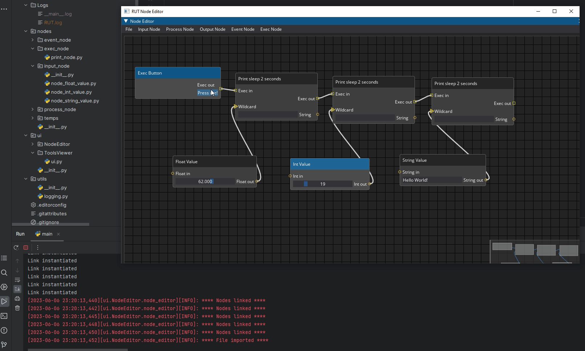

# Welcome to RiotUniversalTool's documentation!

```{toctree}
:caption: Contents
:maxdepth: 1

usage
api
```


<a name="readme-top"></a>

<!-- PROJECT LOGO -->
<br />
<div align="center">
  <a href="https://vngitlab.virtuosgames.com/techart/CTS/-/tree/dev_RiotUniversalTool/CTS_ProjectSetup/RIOT/RiotUniversalTool">
    
  </a>

<h3 align="center">Riot Universal Tool</h3>

  <p align="center">
    Pipeline tools for Riot projects on Sparx, and more ..
    <br />
    <a href="https://vngitlab.virtuosgames.com/techart/CTS/-/tree/dev_RiotUniversalTool/CTS_ProjectSetup/RIOT/RiotUniversalTool/docs"><strong>Explore the docs »</strong></a>
    <br />
    <br />
    <a href="https://vngitlab.virtuosgames.com/techart/CTS/-/tree/dev_RiotUniversalTool/CTS_ProjectSetup/RIOT/RiotUniversalTool">View Demo</a>
    ·
    <a href="https://vngitlab.virtuosgames.com/techart/CTS/issues">Report Bug</a>
    ·
    <a href="https://vngitlab.virtuosgames.com/techart/CTS/issues">Request Feature</a>
  </p>
</div>


<!-- TABLE OF CONTENTS -->
<details>
  <summary>Table of Contents</summary>
  <ol>
    <li>
      <a href="#about-the-project">About The Project</a>
    </li>
    <li>
      <a href="#getting-started">Getting Started</a>
      <ul>
        <li><a href="#prerequisites">Prerequisites</a></li>
        <li><a href="#installation">Installation</a></li>
      </ul>
    </li>
  </ol>
</details>


<!-- ABOUT THE PROJECT -->
## About The Project

A tool consist of 2 main aplication that work hand in hand with each other
1. **Node Editor**: a node graph designer environment that let user create/debug automation tasks. Saved `.json` files can be loaded
on *Tools Viewer* to execute it in practice

2. **Tools Viewer**: a GUI widget that aggregates events saved from *Node Editor* that lets end users executing designated
events at runtime.

<!-- GETTING STARTED -->
## Getting Started


### Prerequisites

* Python 3.7 or above
* Have all the modules specified in `requirements.txt` installed

### Installation

1. Clone the repo
    ```sh
    git clone https://vngitlab.virtuosgames.com/techart/CTS.git
    ```
2. Make sure your Python environment has the modules specified in `requirements.txt`
<p align="right">(<a href="#readme-top">back to top</a>)</p>

