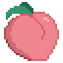
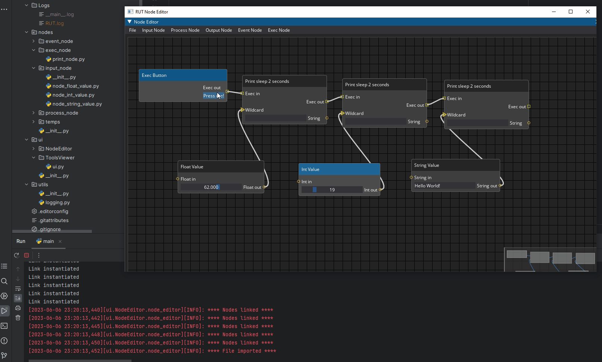

# Welcome to Momotarou's documentation!

```{toctree}
:caption: Contents
:maxdepth: 1

usage
api
```


<a name="readme-top"></a>

<!-- PROJECT LOGO -->
<br />
<div align="center">
  <a href="https://vngitlab.virtuosgames.com/techart/charactertech/projectsetup/momotarou">
    
  </a>

<h3 align="center">Momotarou</h3>
  <p align="center">
    A Pipeline toolset, and more ...
    <br />
    <a href="https://vngitlab.virtuosgames.com/techart/charactertech/projectsetup/momotarou/-/tree/main/src/docs/source"><strong>Explore the docs »</strong></a>
    <br />
    <br />
    <a href="https://vngitlab.virtuosgames.com/techart/charactertech/projectsetup/momotarou/-/tree/main/examples">Examples</a>
    ·
    <a href="https://vngitlab.virtuosgames.com/techart/charactertech/projectsetup/momotarou/issues/new">Report Bug</a>
    ·
    <a href="https://vngitlab.virtuosgames.com/techart/charactertech/projectsetup/momotarou/issues/">Request Feature</a>
  </p>
</div>


<!-- TABLE OF CONTENTS -->
<details>
  <summary>Table of Contents</summary>
  <ol>
    <li>
      <a href="#about-the-project">About The Project</a>
    </li>
    <li>
      <a href="#get-started">Get Started</a>
      <ul>
        <li><a href="#contributors">Contributors</a></li>
        <li><a href="#normal-users">Normal users</a></li>
      </ul>
    </li>
    <li>
      <a href="#report-issues">Report issues</a>
    </li>
    <li>
      <a href="#need-support">Need support?</a>
    </li>
    <li>
      <a href="#roadmap">Roadmap</a>
    </li>
    <li>
      <a href="#contact">Contact</a>
    </li>
  </ol>
</details>


<!-- ABOUT THE PROJECT -->
## About The Project

A toolset consists of 2 main applications that work hand in hand with each other:
1. **Node Editor**: a UE-Blueprint inspired node graph designer that lets user create and debug automation tasks. 
Saved `.mproject` files can be loaded on *Tools Viewer*

2. **Tools Viewer**: an end-user-targeted GUI widget that loads `.mproject` from *Node Editor*. End users can execute
implemented event callbacks through button clicks

<p align="right">(<a href="#readme-top">back to top</a>)</p>

<!-- GET STARTED -->
## Get started

<!-- CONTRIBUTORS -->
### Contributors

#### Prerequisites
* Python 3.7 or above
* Have all the modules specified in `requirements.txt` installed

#### Installation

1. Fork the Project
2. Make sure your Python environment has the modules specified in `requirements.txt`


#### How to contribute

Contributions are what make the open source community such an amazing place to learn, inspire, and create. Any contributions you make are **greatly appreciated**.

If you have a suggestion that would make this better, please fork the repo and create a pull request. You can also simply open an issue with the tag "enhancement".
Don't forget to give the project a star! Thanks again!

1. Fork the Project
2. Create your Feature Branch (`git checkout -b feature/AmazingFeature`)
3. Commit your Changes (`git commit -m 'Add some AmazingFeature'`)
4. Push to the Branch (`git push origin feature/AmazingFeature`)
5. Open a Pull Request

#### Usage

##### Tools Viewer
1. To run Tools Viewer application. Execute the CMD
    ```sh
    python.exe ...momotarou/src/main_tools_viewer.py 
    ```
Further usage guides can be found in the [Tools Viewer user guide](https://techart.vngitpages.virtuosgames.com/charactertech/projectsetup/momotarou/content/ToolsViewer.html)
##### Node Editor
1. To run Node Editor application. Execute the CMD
    ```sh
    python.exe ...momotarou/src/main_node_editor.py 
    ```
Further usage guides can be found in the [Node Editor user guide](https://techart.vngitpages.virtuosgames.com/charactertech/projectsetup/momotarou/content/NodeEditor.html)
<p align="right">(<a href="#readme-top">back to top</a>)</p>


<!-- NORMAL USERS -->
### Normal users

#### Prerequisites
* OS: Windows

#### Installation
1. Get the latest stand-a-lone `.zip`: [Release](https://vngitlab.virtuosgames.com/techart/charactertech/projectsetup/momotarou/-/releases)
2. Extract it to any directory in your PC

#### Usage

##### Tools Viewer
* In the installation directory, execute `ToolsViewer/ToolsViewer.exe`
##### Node Editor
* In the installation directory, execute `ToolsViewer/NodeEditor.exe`
<p align="right">(<a href="#readme-top">back to top</a>)</p>


<!-- REPORT ISSUES -->
## Report issues
1. Feel free to report an issue here [Report Issue](https://vngitlab.virtuosgames.com/techart/charactertech/projectsetup/momotarou/issues/new)


<!-- NEED SUPPORTS -->
## Need support?
Please contact the author to via the provided social medias listed at the bottom of this page. Or give him a ping on MS Teams
if you are working in the same workplace.

<p align="right">(<a href="#readme-top">back to top</a>)</p>


<!-- ROADMAP -->
## Roadmap

- [X] Node Editor
- [X] Tools Viewer
- [ ] Modules
    - [X] Perforce
    - [ ] Maya
    - [ ] 3DS Max

See the [Issues list](https://vngitlab.virtuosgames.com/techart/charactertech/projectsetup/momotarou/issues) for a 
complete list of proposed features and issues.
<p align="right">(<a href="#readme-top">back to top</a>)</p>

<!-- CONTACT -->
## Contact

Tu Nguyen - [Facebook](https://www.facebook.com/nguyenanh.tuantu) - tu.nguyen_b@virtuosgames.com

Project Link: [https://vngitlab.virtuosgames.com/techart/charactertech/projectsetup/momotarou)

<p align="right">(<a href="#readme-top">back to top</a>)</p>

